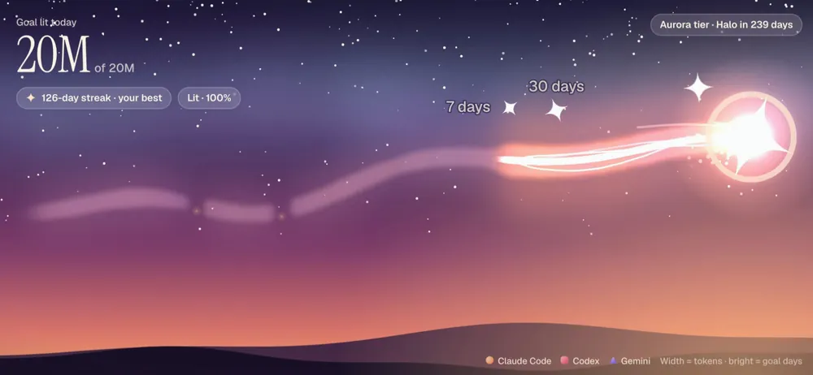
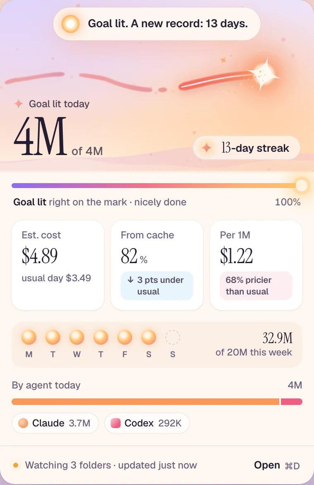
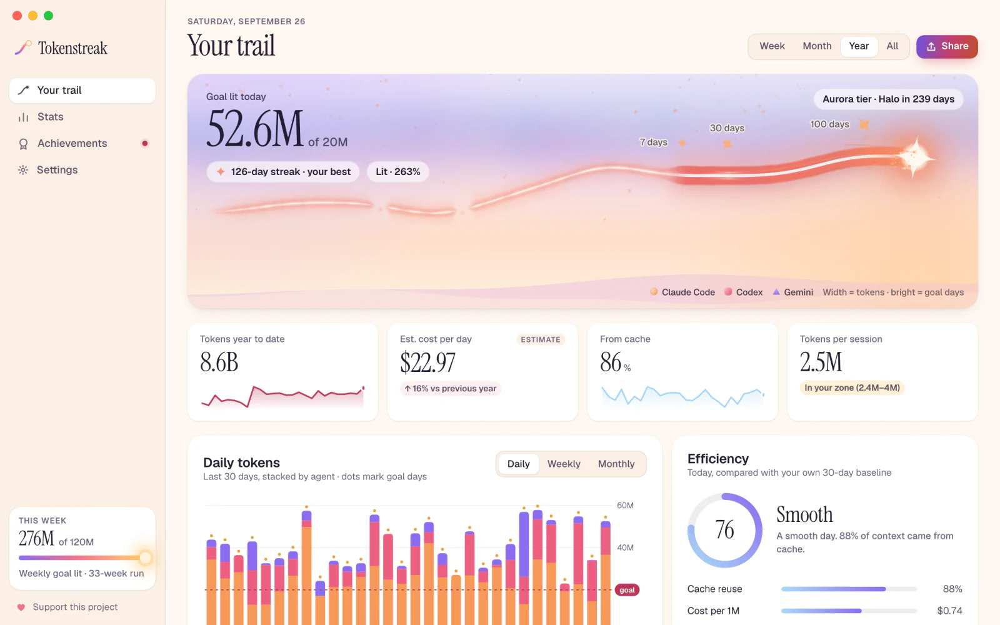
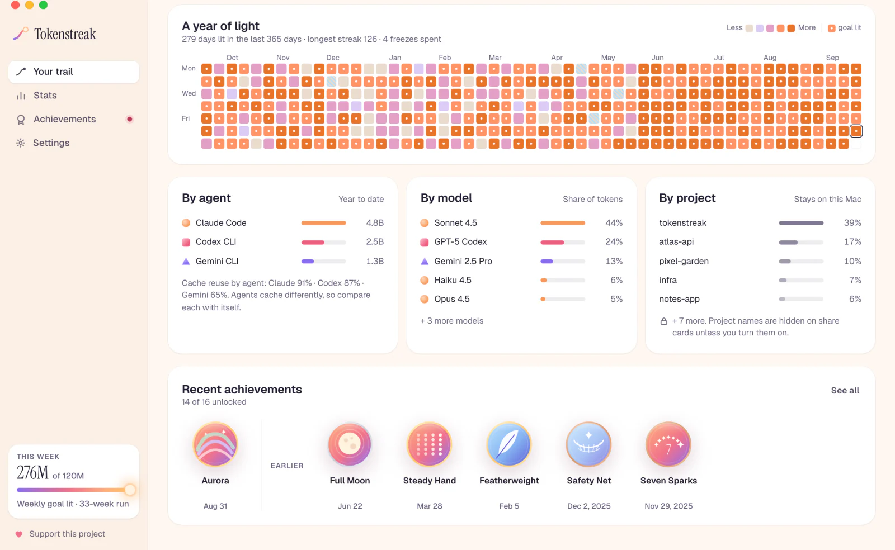
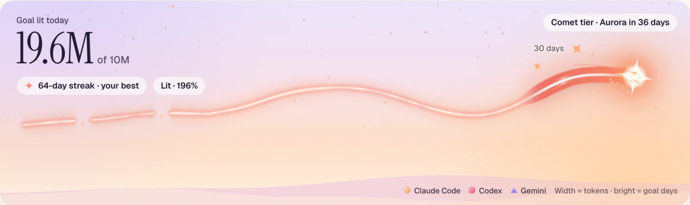
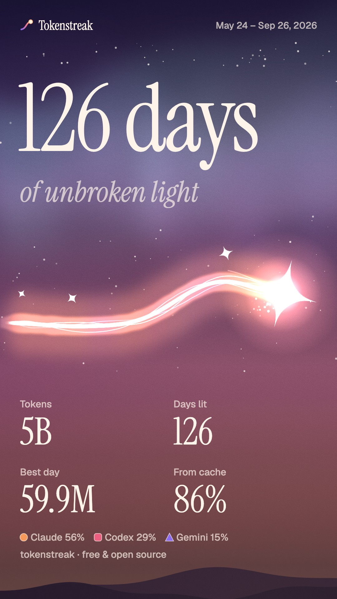
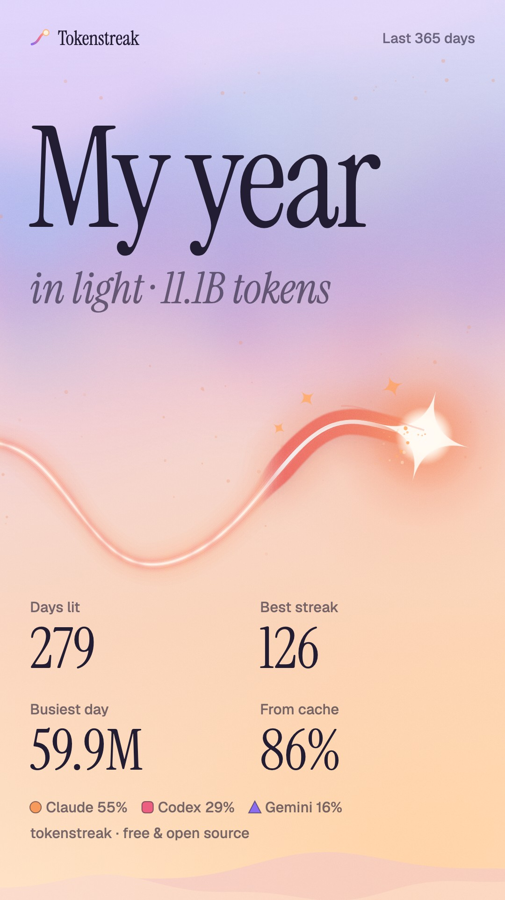
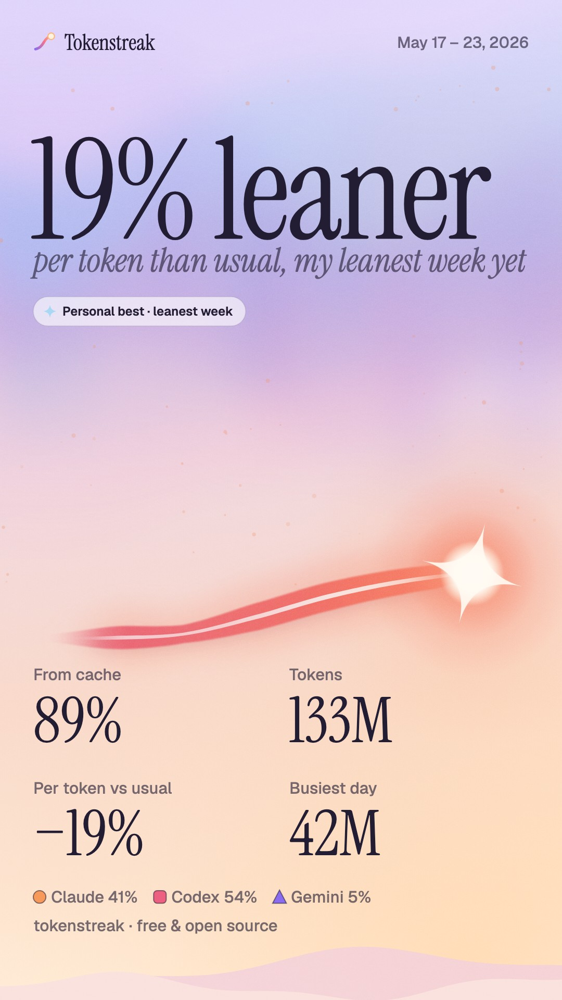
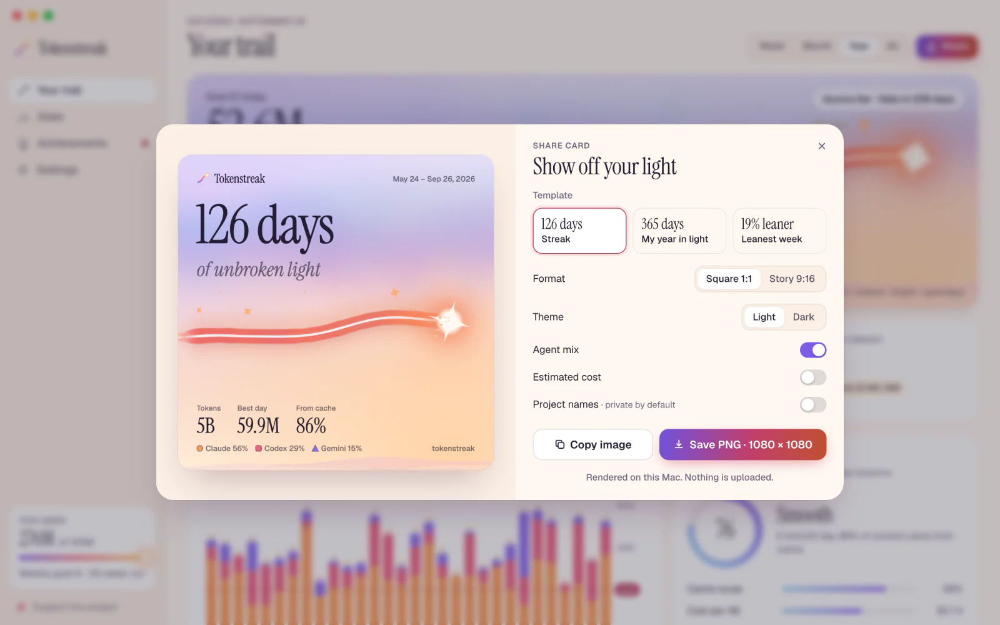

<p align="center">
  
</p>

<p align="center">
  <picture>
    <source media="(prefers-color-scheme: dark)" srcset="brand/logo-lockup-light.svg">
    
  </picture>
</p>

<h3 align="center">Your AI coding streak, drawn in light.</h3>

<p align="center">
  A free, open-source Mac menu-bar app that turns your Claude Code, Codex and Gemini CLI tokens<br>
  into daily goals, streaks, achievements and a living Trail of light. Everything stays on your Mac.
</p>

<p align="center">
  <a href="LICENSE"></a>
  
  
  
</p>

<p align="center">
  <a href="#install">Install</a> ·
  <a href="#features">Features</a> ·
  <a href="#the-trail">The Trail</a> ·
  <a href="#privacy">Privacy</a>
</p>

---

## Why

You run agents all day. They read, write, test and refactor, and at the end of it all you have is a terminal that scrolled away. Tokenstreak gives that work a shape. It reads the usage logs your coding agents already keep, sets a daily goal, and draws every day you show up as a stretch of light across a dusk sky. Hit your goal and the comet ignites. Keep going and the Trail grows, gathers stars and, eventually, an aurora. It is a habit tracker for building with agents. The numbers are honest, the goal moment has a little ceremony, and the history is something you will want to look at.

## Features

<table>
  <tr>
    <td width="50%" valign="top">
      <h3>A two-second glance</h3>
      <p>Click the menu-bar glyph for today's tokens against your goal, your streak, estimated cost, cache reuse, the week so far and a per-agent breakdown. The glyph itself fills as the day's goal gets closer.</p>
    </td>
    <td width="50%" valign="top">
      <picture>
        <source media="(prefers-color-scheme: dark)" srcset="docs/media/screens/popover-dark.webp">
        
      </picture>
    </td>
  </tr>
</table>

**The goal moment.** When today crosses your goal, the comet at the head of the Trail flares, your streak ticks forward and a quiet notification lands. Notifications are optional and respect quiet hours.

**Your whole history, on day one.** First launch finds the agents you already use and replays everything they have logged, so the Trail starts full instead of empty. Then you pick a goal that fits how you actually work.

<picture>
  <source media="(prefers-color-scheme: dark)" srcset="docs/media/screens/dashboard-dark.webp">
  
</picture>

**A dashboard worth opening.** The Trail in full, week, month, year or all time. A year-long heatmap, daily, weekly and monthly charts, and breakdowns by agent, model and project.

**Efficiency next to volume.** Cache reuse, estimated cost per day and per million tokens, and tokens per session, each compared with your own 30-day baseline. Costs are estimates from the open [LiteLLM](https://github.com/BerriAI/litellm) price list, bundled with the app and labelled as estimates everywhere.

<picture>
  <source media="(prefers-color-scheme: dark)" srcset="docs/media/screens/history-dark.webp">
  
</picture>

**Streaks that forgive.** Every 7 goal days in a row earns a streak freeze, and you can hold two. Miss a day and one is spent automatically, so the streak survives. Rest days you choose neither break nor extend it. A broken run never disappears: it stays in the sky as afterglow.

**Sixteen achievements** from First Light to Galaxy, each with its own badge and unlock date. **Goals** can be daily and weekly. **Launch at login**, a **global shortcut** and **CSV export** are in Settings.

## The Trail

<picture>
  <source media="(prefers-color-scheme: dark)" srcset="docs/media/screens/trail-long-dark.webp">
  
</picture>

The Trail is your streak, drawn as a streak of light. Every mark on it means something:

| What you see | What it means |
|---|---|
| **Width** | Tokens that day against your goal. A big day swells the ribbon. |
| **Strands** | Your agent mix: apricot for Claude Code, rose for Codex, violet for Gemini, braided in proportion. |
| **Core** | Efficiency. In the current run, the more of a day served from cache, the whiter its core burns. |
| **Brightness** | Goal days glow. The current run burns brightest; older history stays in the sky as a slimmer, calmer ribbon. |
| **Gaps** | Days off. A day with no tokens is a clean break with a single ember; rest days and spent freezes keep a thinner bridge of light. |
| **The comet** | Today. Its halo ring fills as you approach the goal and ignites when you hit it. |

Over long ranges the axis bends: the current run and the two weeks before it keep at least a third of the width, and older history is compressed. When days get too narrow to show every gap, the ribbon only breaks for empty stretches and the legend switches from *gaps = days off* to *bright = goal days*.

The sky changes with your streak, from *Kindling* to *Ember*, *Glow* (7 days, milestone stars appear), *Comet* (30), *Aurora* (100, curtains of light above the horizon) and *Halo* (365). The horizon warms as today's progress grows.

## Share cards

Export a PNG in square (1:1) or story (9:16), light or dark. Cards are rendered on your Mac; project names are hidden unless you turn them on.

<p align="center">
  
  &nbsp;
  
  &nbsp;
  
</p>

<picture>
  <source media="(prefers-color-scheme: dark)" srcset="docs/media/screens/share-dark.webp">
  
</picture>

## Supported agents

| Agent | Where Tokenstreak looks |
|---|---|
| **Claude Code** | `~/.claude/projects/` (and `CLAUDE_CONFIG_DIR`) |
| **Codex CLI** | `~/.codex/sessions/` (and `CODEX_HOME`) |
| **Gemini CLI** | `~/.gemini/tmp/<project>/chats/` (and `GEMINI_CLI_HOME`, `GEMINI_DATA_DIR`) |

Custom folders can be added in Settings. Folders are watched, so the popover updates within seconds of your agent writing a line (always within 60 s). Cursor and other cloud-only tools are not supported, because their usage is not in local logs.

## Privacy

Tokenstreak reads **usage numbers only**: token counts, model names, timestamps and project folder names. It never reads, stores or displays your prompts or your agents' responses; a test plants sentinel strings in those fields and checks they never reach app state, storage, exports or logs.

There is no account, no server, no telemetry and no analytics. **Nothing leaves your Mac**, except when you press *Refresh prices*, which downloads the public LiteLLM price list from GitHub. Project names stay off share cards unless you opt in.

## Install

Tokenstreak is built from source for now (signed downloads may come later).

```sh
git clone https://github.com/btahir/tokenstreak.git
cd tokenstreak
./build.sh
```

You need macOS 12 or later, the Xcode Command Line Tools (`xcode-select --install`), Node 20+, pnpm and Rust ([rustup.rs](https://rustup.rs)). The script prints the path of `Tokenstreak.app` and a `.dmg` under `target/release/bundle/`. Drag the app to Applications.

> [!NOTE]
> The build is not notarized by Apple, so the first launch is blocked by Gatekeeper. **Right-click Tokenstreak.app and choose Open**, then confirm. You only need to do this once. (On recent macOS versions you may instead need *System Settings → Privacy & Security → Open Anyway*.)

`./build.sh --test` runs the test suites first, and `./build.sh --clean` starts from scratch.

## Develop

```sh
pnpm install
pnpm tauri dev      # the real app, with hot reload
pnpm dev:web        # the UI in a browser with synthetic data, no Rust needed
```

`pnpm dev:web` serves the popover and dashboard against a mock backend. Add `?preset=` to switch scenes (`new-user`, `first-run-reveal`, `streak-30`, `heavy-multi-tool`, `goal-hit`, `streak-at-risk`, `long-history`, `sparse`), `?view=dashboard` for the dashboard and `?theme=dark` to force a theme. The mock data is generated, never taken from real logs.

### Architecture

```
crates/tokenstreak-core   Rust library: log readers, dedup, pricing, aggregation,
                          goals and streaks, achievements, file watching, cache
src-tauri                 Tauri 2 shell: tray and popover, dashboard window,
                          notifications, launch at login, global shortcut
src                       React + TypeScript UI: popover, dashboard, the Trail
                          (canvas), charts, share-card renderer, mock backend
```

The core parses logs incrementally and keeps a small cache, so relaunches rescan in tens of milliseconds. On the development Mac, a first launch read 16 GB of real logs in about 4 seconds with today's numbers on screen after about 0.1 s; idle, the app uses about 0.1% CPU and 75 MB. The UI talks to the core through typed commands generated from Rust (`pnpm gen:bindings`).

### Tests

```sh
cargo test -p tokenstreak-core   # parsing, streaks, privacy, robustness, incremental rescans
pnpm test:oracle                 # daily totals vs ccusage on every fixture set
pnpm test                        # TypeScript unit tests (Vitest)
pnpm test:e2e                    # Playwright flows and axe accessibility checks
pnpm test:perf                   # 1 GB synthetic parse benchmark (release build)
```

The **ccusage oracle** runs [ccusage](https://github.com/ccusage/ccusage) (`daily --json --offline`) over synthetic fixtures for all three agents (normal sessions, cache reads and writes, several models and projects, malformed lines, duplicates, time-zone boundaries) and requires daily token totals to match exactly and costs to agree within 1%. Fixtures are synthetic; real logs are never committed.

## FAQ

**Does it count my tokens exactly like ccusage?**
Yes, that is the point of the oracle test. The readers, deduplication rules and cost logic are ported from ccusage so the daily totals agree.

**Why tokens? More tokens is not better code.**
Agreed, which is why the goal is yours to set, efficiency sits next to volume, and cache reuse makes the Trail brighter rather than wider. Think of it as a record that you showed up, not a leaderboard. There is no leaderboard.

**Are the costs what I pay?**
They are list-price estimates. If you are on a subscription plan, read them as "what this would have cost on the API".

**Can I use it without Claude Code?**
Yes. Any one of Claude Code, Codex CLI or Gemini CLI is enough.

**Windows or Linux?**
Not yet. v1 is macOS only.

**Does it slow my agents down?**
No. It only reads the log files after your agents write them, rate-limited to one rescan every few seconds.

## Credits

- [ccusage](https://github.com/ccusage/ccusage) by ryoppippi (MIT): the log parsing and cost semantics are ported from it.
- [LiteLLM](https://github.com/BerriAI/litellm) by Berri AI (MIT): the bundled model price list.
- [Tokscale](https://github.com/junhoyeo/tokscale) by Junho Yeo (MIT): inspiration and the incremental-cache design. No Tokscale code is included.
- [Instrument Serif](https://fonts.google.com/specimen/Instrument+Serif) and [Geist](https://vercel.com/font) (SIL Open Font License 1.1).
- Built with [Tauri](https://tauri.app) and [React](https://react.dev).

Full notices are in [CREDITS.md](CREDITS.md).

## Support this project

Tokenstreak is free, with no locked features. If it makes your days with agents a little brighter, you can [support its development](https://shotcandy.vercel.app/support/). A star on GitHub helps too.

## License

[MIT](LICENSE). The artwork in `brand/` is original and MIT licensed with the code.
